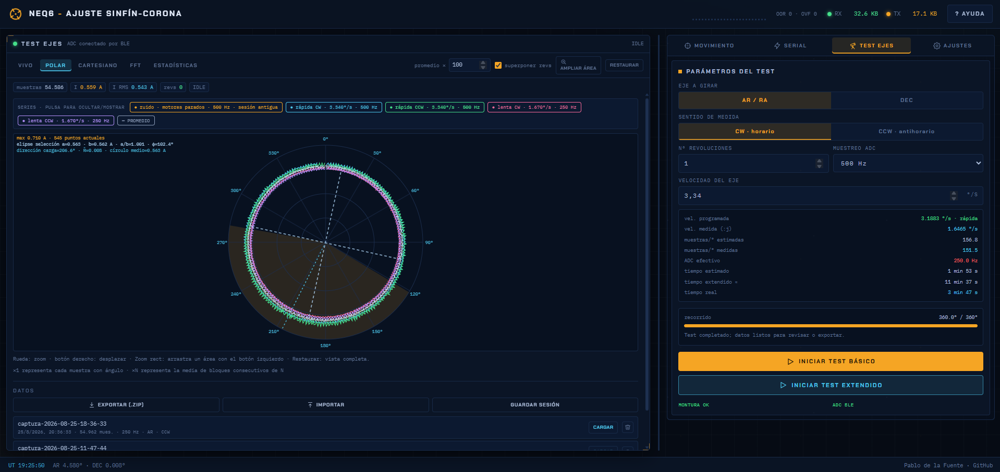
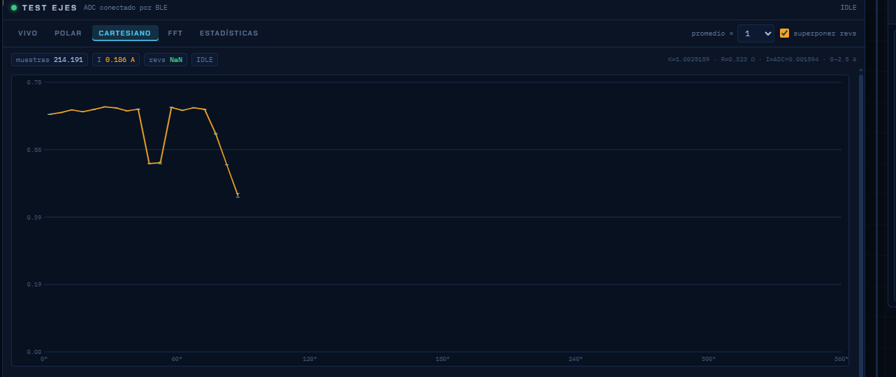
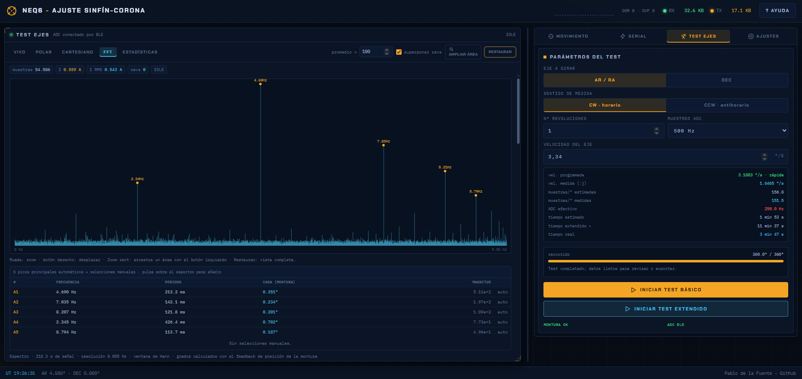
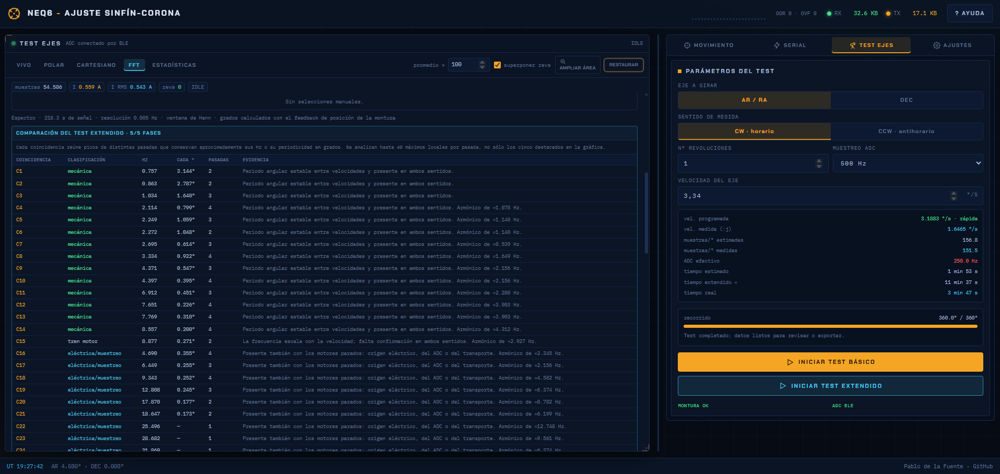
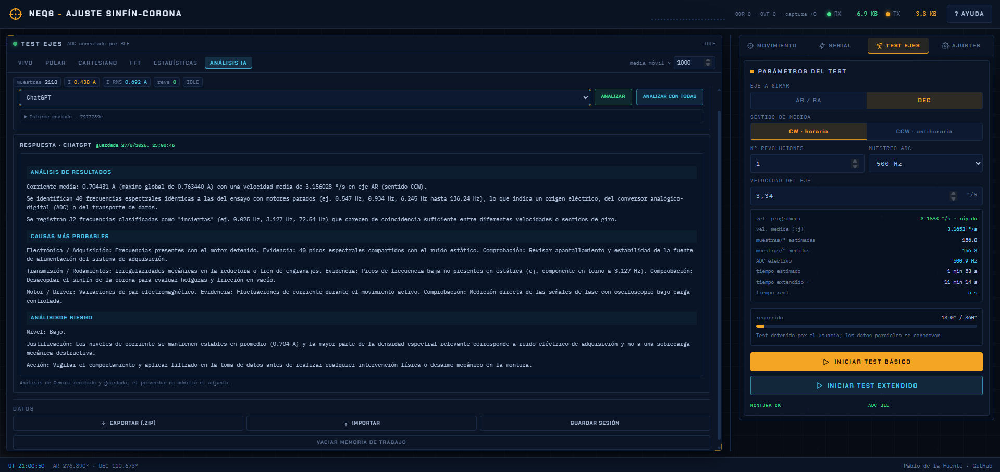

# NEQ6 - Diagnóstico electromecánico por corriente

Aplicación web para controlar los ejes de una montura SkyWatcher NEQ6/EQ6 y
analizar la corriente del motor durante una o varias vueltas. Cada muestra del
ADC se relaciona con la posición informada por la controladora para construir
un perfil angular del esfuerzo exigido al accionamiento.

El ajuste del conjunto sinfín-corona fue el origen del proyecto, pero no limita
su uso. Una variación repetible de corriente puede revelar rozamiento o
excentricidad del sinfín-corona, desalineación o flexión de ejes, rodamientos
dañados, defectos de transmisión, desequilibrio de carga u otros problemas
mecánicos que modifiquen el par requerido. La comparación con el ruido de los
motores detenidos y con distintas velocidades también puede señalar anomalías
eléctricas, del driver, de alimentación o de adquisición. La aplicación permite
además comandar la montura mediante EQDirect por puerto serie.


## Funciones principales

- Control de AR/RA y DEC mediante EQDirect.
- Comunicación con la montura por serial.
- Medición de corriente de la montura mediante ADC del Flipper Zero conectado
  por BLE (o por su segundo puerto USB-COM).
- Test automático del esfuerzo electromecánico del accionamiento en ambos ejes:

  - Análisis de Fourier (FFT).
  - Gráficas online: representación polar, cartesiana y FFT.
  - Estadísticas sobre el ángulo de esfuerzo y posibles deformaciones en el
    sistema.
  - Grabación de sesiones y exportación de datos.

## Requisitos

- Windows, Linux o macOS con Node.js 20 o posterior.
- Chrome o Edge de escritorio.
- Adaptador EQDirect/UART-USB para la montura.
- Flipper Zero con `NEQ6 Current`, o un logger ADC compatible.
- Shunt configurable en serie a la fuente.

## Instalación

```powershell
git clone <URL-DEL-REPOSITORIO>
cd NEQ6_worm_gear_calibration
npm ci
npm run dev
```

Abre [http://127.0.0.1:3000](http://127.0.0.1:3000) en Chrome o Edge. El
servidor escucha también en la red local; no lo expongas a Internet sin añadir
autenticación y HTTPS.

Para comprobar la instalación:

```powershell
npm run check
```

## Preparar el Flipper Zero

1. Compila o instala la aplicación de `flipper_fw/neq6_current_logger`.
2. Conecta el shunt a PA7/A7 según la [configuración del Flipper](wiki/Configuracion-del-Flipper.md).
3. Ejecuta **NEQ6 Current** en el Flipper.
4. En **Ajustes → Conexión Flipper**, intenta primero BLE.

## Primera medición

1. Libera el recorrido y comprueba cables, frenos y equilibrio.
2. En **Ajustes**, conecta la montura a 9600 8N1.
3. Comprueba en **Ajustes** que el diagnóstico automático detecta CPR y timer.
4. En **Test ejes**, selecciona AR/DEC, CW/CCW, vueltas, ADC y velocidad.
5. Empieza con 1 vuelta, 500 Hz y una velocidad segura para la instalación.
6. Pulsa **Iniciar test básico** o, para comparar velocidades y sentidos y tener un análisis FFT más extenso,
   **Iniciar test extendido**.

El eje se mueve primero 2° en el sentido opuesto mediante un GOTO corto. Después
invierte el sentido y usa velocidad continua estable; la adquisición comienza
cuando se confirma el cruce por 0°. Al completar el recorrido útil se detiene
el ADC.

## Resultados

- **Polar:** corriente frente a fase angular.

- **Cartesiano:** corriente frente a grados.

- **FFT básica:** cinco picos automáticos y picos manuales; convierte cada periodo a
  separación angular usando la velocidad medida.


- **Estadísticas:** corriente, ruido, tasa efectiva, muestras por grado,
  parámetros de la elipse, esfericidad y estadísticas circulares.

- **Análisis IA opcional:** compara el resumen, las series y los espectros del
  ensayo con un proveedor configurado por el usuario. El informe separa
  resultados, causas probables y riesgo; puede proponer hipótesis mecánicas,
  de transmisión, electrónicas o de adquisición, pero siempre requiere
  contrastación experimental.


## Evolución prevista

El Flipper Zero se empleó porque era el dispositivo disponible durante unas
vacaciones, no porque sea un requisito del proyecto. El siguiente paso previsto
es sustituirlo por un microcontrolador con ADC propio o externo, por ejemplo un
ESP32 con ADC externo, un Arduino u otra placa de facil acceso.


## Seguridad

El shunt debe estar calculado para que la máxima corriente que circule por el
sistema produzca una caída de potencial admisible por el ADC; en el caso del
Flipper Zero, no debe superar 2,5 V.

Asegúrate de que la potencia disipada en el shunt sea soportada por la
resistencia o conjunto de resistencias.

### Configuración usada y cálculos

La configuración inicial usa `R_shunt = 0,323 Ω` . Las
resistencias que forman este shunt eran las que tenía a mano en ese momento;
la resistencia total y el factor de calibración se pueden modificar en
**Ajustes** y se guardan con cada sesión.

- Un paso de ADC equivale a `2,5 / 4096 = 0,610 mV`; con esta calibración son
  aproximadamente `1,894 mA` por cuenta.
- Caída en el shunt: `V_shunt = I × 0,323 Ω`. A `2,5 A`, la caída es
  `0,8075 V`, dentro del límite de `2,5 V` del ADC.
- Potencia disipada: `P = I² × 0,323 Ω`. A `2,5 A`, el shunt disipa
  `2,019 W`; hay que dimensionarlo con margen térmico suficiente y verificarlo
  en la instalación real.


## Licencia, responsabilidad y asistencia

El proyecto usa [GNU Affero General Public License v3.0](LICENSE) (`AGPL-3.0-only`). Permite usar, estudiar, modificar, redistribuir y
comercializar el software, pero exige conservar la licencia, los avisos y la
referencia al [proyecto original](https://github.com/PablodlFuente/NEQ6_worm_gear_calibration).
Los servicios de red modificados deben ofrecer su código fuente correspondiente.

El software se proporciona tal cual y sin garantía. El usuario asume los riesgos
eléctricos, mecánicos y operativos. Consulta el [aviso completo](NOTICE.md).

El diseño, lógica y características del programa es de desarrollo humano. La codificación, revisión y documentación del proyecto han sido asistidas por
OpenAI Codex y Qwen3.8. Durante todo el desarrollo se mantiene supervisión humana.
