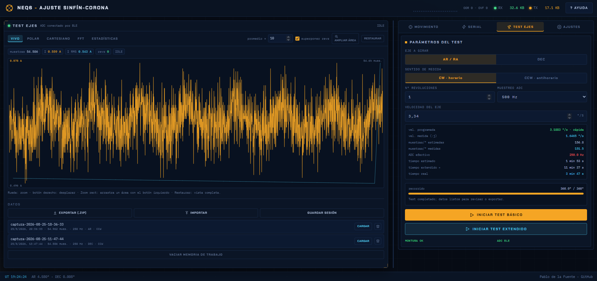

# NEQ6 - Ajuste sinfín-corona

Esta documentación describe un banco de medida angular de corriente para la
Sky-Watcher NEQ6/EQ6. No es un sustituto de EQMOD, SynScan ni de un analizador
de motores. Su objetivo es adquirir la corriente del eje mientras la placa de
motores informa de su posición, conservar la señal sin agrupar y proporcionar
herramientas para comparar vueltas, sentidos y velocidades.

## Nivel y alcance

Se presupone que el lector sabe trabajar con electrónica de baja tensión,
shunts, UART, motores paso a paso y análisis básico de señales. La wiki explica
las decisiones específicas de este proyecto, pero no enseña desde cero a usar
un multímetro, dimensionar una protección ni ajustar mecánicamente una montura.

El sistema relaciona tres dominios distintos:

1. **Eléctrico:** el ADC del Flipper mide la caída en un shunt low-side.
2. **Temporal:** cada conversión incorpora un contador monotónico en
   microsegundos; la web sincroniza ese reloj con el navegador.
3. **Mecánico:** las consultas de posición de la placa de motores actúan como
   anclas angulares y la web interpola las muestras comprendidas entre ellas.

El contador de posición pertenece a la controladora de pasos. No existe un
encoder absoluto en el eje de salida: un bloqueo con pérdida física de pasos
puede no quedar reflejado correctamente en la posición comunicada.

## Ruta recomendada

- [Arquitectura y modelo de medida](Arquitectura-y-modelo-de-medida.md)
- [Instalación y verificación](Instalacion.md)
- [Protocolo y movimiento](Protocolo-y-movimiento.md)
- [Flipper Zero y cadena ADC](Flipper-Zero.md)
- [Procedimiento de ensayo](Procedimiento-de-ensayo.md)
- [Análisis de datos](Analisis-de-datos.md)
- [Formato de datos y exportación](Formato-de-datos-y-exportacion.md)
- [Registro y diagnóstico](Registro-y-diagnostico.md)
- [Seguridad, limitaciones y autoría](Seguridad-limitaciones-y-autoria.md)
- [Referencias](Referencias.md)

## Criterio de interpretación

Una irregularidad reproducible a la misma fase angular es evidencia de una
dependencia con la posición, no la identificación automática de una pieza.
Antes de atribuirla al sinfín, hay que repetir el ensayo, invertir el sentido,
cambiar la velocidad, comprobar la tasa ADC efectiva y contrastar el ruido con
los motores parados. La intervención mecánica debe basarse en tendencias
repetibles y no en un único máximo.

## Licencia y responsabilidad

El código se distribuye bajo GNU AGPL v3 (`AGPL-3.0-only`): permite usar,
estudiar, modificar, redistribuir y comercializar el proyecto, pero los
derivados deben conservar la licencia, los avisos y la atribución al proyecto
original. Las versiones modificadas usadas por red deben ofrecer su fuente
correspondiente. Consulta [LICENSE](https://github.com/PablodlFuente/NEQ6_worm_gear_calibration/blob/HEAD/LICENSE)
y [NOTICE.md](https://github.com/PablodlFuente/NEQ6_worm_gear_calibration/blob/HEAD/NOTICE.md).

El software se entrega sin garantía. El uso de movimiento de bajo nivel, el
cableado del shunt y cualquier ajuste mecánico son responsabilidad del usuario.
La programación del proyecto ha sido asistida por OpenAI Codex.
