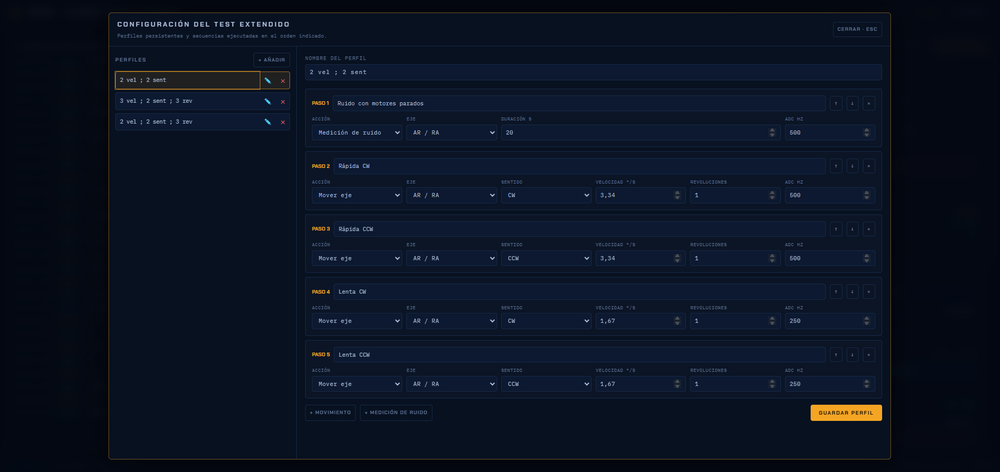

# Recorrido técnico por la interfaz

## Movimiento manual

La pestaña **Movimiento** reúne giros de ángulo definido y *jog*. Un giro
programado tiene destino y frenado; un jog mantiene velocidad continua mientras
se pulsa una flecha. Los indicadores de posición del pie proceden del comando `:j`, pero
son cuentas del controlador, no un encoder mecánico real.

## Consola y protocolo serie

La consola conserva orden temporal, dirección TX/RX y decodificación. Consulta
[Protocolo y movimiento](Protocolo-y-movimiento).

## Ajustes y diagnóstico

En esta vista se conecta la montura y el Flipper Zero al software. El diagnóstico lee firmware, CPR, temporizador y ratio de alta velocidad. CPR y
TMR determinan la conversión entre cuentas, grados, T1 y velocidad. También se
elige la calibración del shunt y se administran los perfiles del test extendido.

El editor de perfiles ocupa una ventana independiente. Su columna izquierda
permite añadir, seleccionar, editar y eliminar perfiles con nombre propio. El
botón derecho sobre un perfil abre la opción para duplicarlo. La
secuencia de la derecha se ejecuta de arriba abajo y admite dos tipos de paso:

- **Mover eje**: eje AR/DEC, CW/CCW, velocidad, revoluciones y tasa ADC.
- **Medición de ruido**: eje asociado a la sesión, duración y tasa ADC, con los motores parados.

Los pasos se pueden reordenar y cada perfil queda guardado en el navegador. El
perfil inicial reproduce el ensayo comparativo anterior: ruido estacionario y
cuatro vueltas a dos velocidades en ambos sentidos.

Los campos **eje**, **sentido**, **velocidad**, **revoluciones** y **ADC Hz**
pueden conservar un valor fijo o elegir **Interfaz**. En ese modo no se copia el
valor al editar: cada paso toma el valor que exista en **Parámetros del test**
justo al iniciar el perfil. Esto permite reutilizar una secuencia con distintos
ejes o condiciones sin duplicarla. Las modificaciones del perfil se guardan
automáticamente.

## Test durante la adquisición

Durante un test se muestran corriente instantánea, I RMS, muestras, progreso , etc. En cada test el motor retrocede 2°, invierte el sentido y
cruza el origen ya en régimen. Existen dos test, el basico y el extendido. El básico la montura gira según los parametros configurados de eje, número de rotaciones y velocidad haciendo el analisis de uno de los ejes.
Al pulsar **Iniciar test extendido** se despliega la lista de perfiles y se elige
la secuencia que se va a ejecutar. El perfil activo no hereda silenciosamente
los parámetros del test básico: cada paso contiene todos sus parámetros.

## Estadísticas durante el test

Se dan valores de la estadística de la medición, el usuario puede poner el cursor enciama de cada una de ellas para ver una descripción de ellas.

Con **Revs. independientes** activada, las vueltas se analizan como series
superpuestas en `0–360°`. Desactivada, forman una adquisición continua de
hasta `N×360°`.
El cambio afecta también al promedio, la FFT y el resumen estadístico; el
indicador de modo aparece en las vistas correspondientes. El mismo criterio se
aplica a cualquier paso del test extendido que contenga más de una revolución.

## FFT de una serie

El eje horizontal está en Hz. Para un fenómeno ligado a la geometría interesa
también su periodo angular, calculado con la velocidad.

## Comparación FFT extendida

El perfil extendido inicial añade una fase de ruido con motores parados y cuatro
pasadas móviles. La clasificación mecánica o eléctrica es comparativa y debe
contrastarse con la arquitectura de la montura.

## Representación polar

 El círculo medio, dirección de carga (linea punteada), sectores de carga mayor (sombreado naranja) y elipse resumen propiedades
mecanicas del sistema. Ocultar series recalcula el análisis con las curvas visibles; no
altera los datos guardados.

## Representación cartesiana

La misma medida se representa como corriente frente a ángulo. Es la vista más
adecuada para cuantificar anchuras, discontinuidades y barras de error. 

## Lectura siguiente

- [Procedimiento de ensayo](Procedimiento-de-ensayo)
- [Análisis de datos](Analisis-de-datos)
- [Formato de datos y exportación](Formato-de-datos-y-exportacion)
