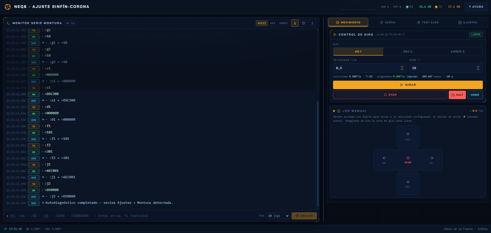
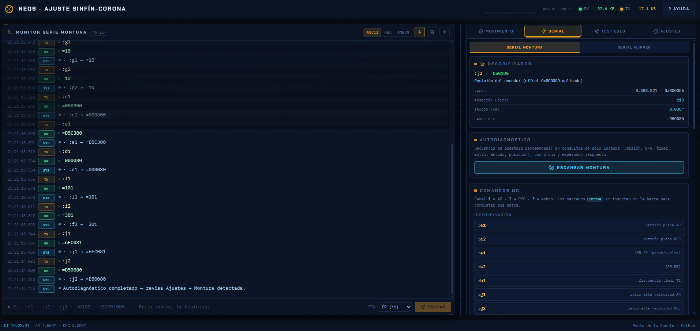
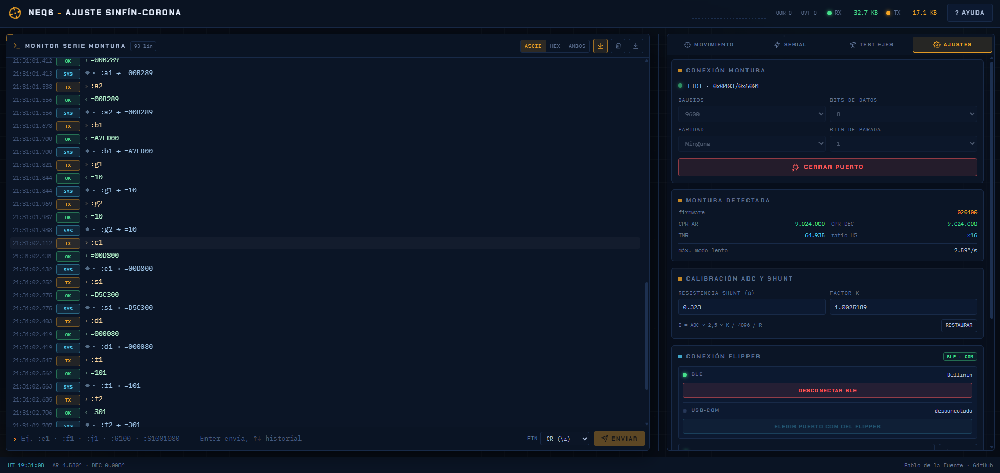
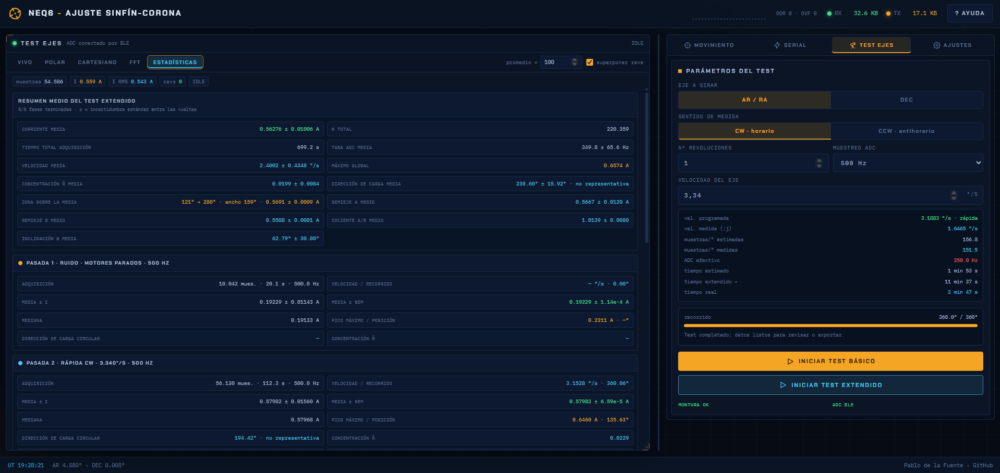

# Recorrido técnico por la interfaz

## Movimiento manual

La pestaña **Movimiento** reúne giros de ángulo definido y *jog*. Un giro
programado tiene destino y frenado; un jog mantiene velocidad continua mientras
se pulsa una flecha. Los indicadores de posición del pie proceden del comando `:j`, pero
son cuentas del controlador, no un encoder mecánico real.

## Consola y protocolo serie

La consola conserva orden temporal, dirección TX/RX y decodificación. Consulta
[Protocolo y movimiento](Protocolo-y-movimiento).

## Ajustes y diagnóstico

En esta vista se conecta la montura y el Flipper Zero al software. El diagnóstico lee firmware, CPR, temporizador y ratio de alta velocidad. CPR y
TMR no son valores ornamentales: determinan la conversión entre cuentas,
grados, T1 y velocidad.También se elige la calibración del shunt.

## Test durante la adquisición

Durante un test se muestran corriente instantánea, I RMS, muestras, progreso , etc. En cada test el motor retrocede 2°, invierte el sentido y
cruza el origen ya en régimen. Existen dos test, el basico y el extendido. El básico la montura gira según los parametros configurados de eje, número de rotaciones y velocidad haciendo el analisis de uno de los ejes.
En el caso del test extendido la montura rota 4 veces (2 velocidades diferentes y ambos sentidos) con el fin de detectar las frecuencias que podrían provenir de problemas mecánicos, hace un análisis más riguroso al tener en cuenta más datos.

## Estadísticas durante el test

Se dan valores de la estadística de la medición, el usuario puede poner el cursor enciama de cada una de ellas para ver una descripción de ellas.

## FFT de una serie

El eje horizontal está en Hz. Para un fenómeno ligado a la geometría interesa
también su periodo angular, calculado con la velocidad.

## Comparación FFT extendida

El test extendido añade una fase de ruido con motores parados y cuatro pasadas
móviles. Laclasificación mecánica o eléctrica es comparativa y debe contrastarse
con la arquitectura de la montura.

## Representación polar

 El círculo medio, dirección de carga (linea punteada), sectores de carga mayor (sombreado naranja) y elipse resumen propiedades
mecanicas del sistema. Ocultar series recalcula el análisis con las curvas visibles; no
altera los datos guardados.

## Representación cartesiana

La misma medida se representa como corriente frente a ángulo. Es la vista más
adecuada para cuantificar anchuras, discontinuidades y barras de error. 

## Lectura siguiente

- [Procedimiento de ensayo](Procedimiento-de-ensayo)
- [Análisis de datos](Analisis-de-datos)
- [Formato de datos y exportación](Formato-de-datos-y-exportacion)
